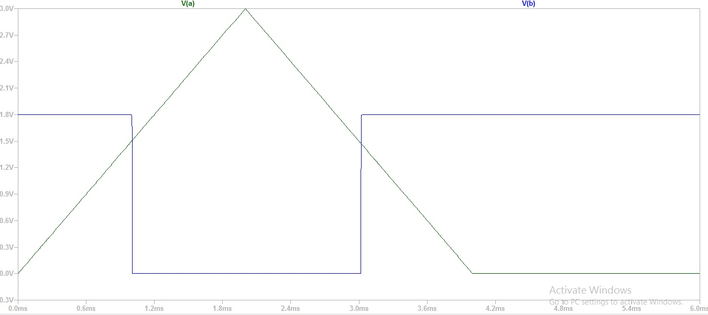
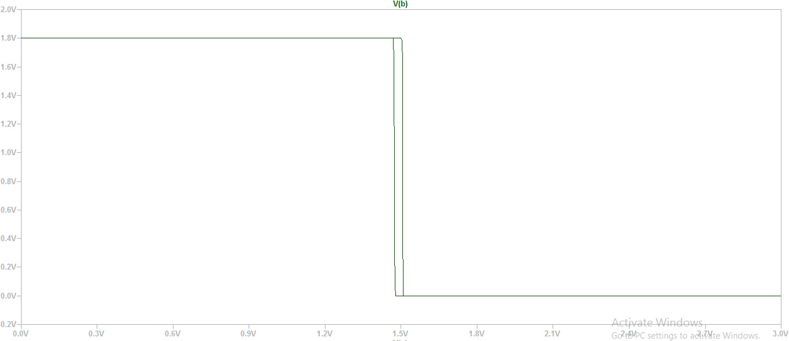

# Vsd-Comparator
This project is developed on LTSPICEXVII Tool. In this Comparator output is given with Hystersis

# Installing of LTSPICE XVII
1. Download LTSPICEXVII from https://www.analog.com/en/design-center/design-tools-and-calculators/ltspice-simulator.html as per you OS.
2. If you dowloaded the .exe  file a window will pop-up which will show licence agreement. Click on accept 
3. Choose the Version of your PC and Click on the Install.

# Setup for Simulation
1. To draw the Circut go to file -> new Scematic.
2. Draw the Sechmatic and Save (Ctrl+s).
3. Download the Comparator.asc file and TSM180nm file in same drive and folder of the LTSPICE XVII installed.
4. To Open the file go to file - open(Ctrl-O) - open the Comparator.asc.
5. To see output and Input waveform click on the Simulate - run.
6. Click on the V(b) and V(b) you will see the output and input waveforms.

7. To see Hystersis Waveform right click on the input waveform V(a) and copy V(a) and click on the Delete the trace.
8. Now give rightclick on the Horizontal axis and Horizontal axis window will pop-up.
9. Paste the V(a) you will see the Hystersis waveform.

# Contact Information
-> G.V.Gurendra Babu B.Tech (Electronics and Communication Engineering) VLITS, Guntur gurendra611@gmail.com 

-> Kunalghosh Director VSD Corp.Pvt.ltd Kunalghosh@gmail.com 

-> PHILIPP GUHRING Software Architect at LibreSilicon Association pg@futureware.at

-> Dr. GAURAV TRIVEDI Co-Principal Investigator,ECIT Academy and Associative Professor, EEE Department,
IIT Guwahati trivedi@iitg.ac.in
